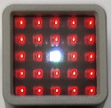
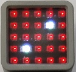
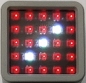
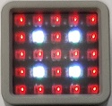
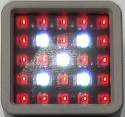
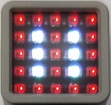

# atom-matrix-dice-d6
An Arduino sketch which turns an Atom Matrix into a digital dice (d6).
Just press the button to roll the dice.








## Requirements
Hardware:

* [Atom Matrix ESP32 Development Kit](https://shop.m5stack.com/collections/m5-atom/products/atom-matrix-esp32-development-kit) (made by [M5Stack](https://m5stack.com))

Software:

* [Arduino IDE](https://www.arduino.cc/en/software)

Arduino libraries *(install these via the Library Manager in the Arduino IDE)*:

* [M5Atom](https://github.com/m5stack/M5Atom)
* [FastLED](https://www.arduino.cc/reference/en/libraries/fastled/)

Note: If this is the first time you are uploading an Arduino sketch to the Atom Matrix then you will
need to do some additional configuration. This includes installing drivers and setting up the board
info in the Arduino IDE. The following blog post explains how to do this on Windows:

* https://peter.bloomfield.online/how-to-program-atom-matrix-and-lite-with-the-arduino-ide-on-windows

## Instructions
1. Load the sketch file (`atom-matrix-dice-d6.ino`) into your Arduino IDE.
2. Connect your Atom Matrix to the computer via USB cable.
3. Select the appropriate COM port in the Arduino IDE.
4. Click the Upload button.

When the sketch has finished compiling and uploading, the dice should be ready to go. Press the
matrix button to roll the dice. Each time you press it, a new random dice roll will be shown.

If you want to completely clear the display, press the reset button on the side of the Atom Matrix.

## Customisation
You can easily change the colour of the display. Look for these lines near the top of the sketch:

```cpp
const CRGB g_foregroundColour{ 0xffffff };

const CRGB g_backgroundColour{ 0x003300 };
```

You can change the colour by adjusting the hexadecimal numbers. The foreground colour is used for
the dots on the dice display, and the background colour is used for everything else.

Here are some common colours to get you started:

* Black: `0x000000`
* White: `0xffffff` (bright), `0x888888` (dark)
* Red: `0x00ff00` (bright), `0x003300` (dark)
* Green: `0xff0000` (bright), `0x330000` (dark)
* Blue: `0x0000ff` (bright), `0x000033` (dark)
* Pink: `0x00ffff` (bright), `0x003333` (dark)
* Yellow: `0xffff00` (bright), `0x333300` (dark)
* Cyan: `0xff00ff` (bright), `0x330033` (dark)

Note: The red and green channels on the Atom Matrix are the wrong way round compared to most other
displays. That's why the hexadecimal values may look a little odd.

## Randomness
The random dice rolls are generated by using the analog-to-digital converter on board the chip. It
takes an analog reading from a floating (disconnected) GPIO pin, divides it by 6, and adds 1 to the
remainder. This results in a somewhat random value between 1 and 6 (inclusive).

Unlike the normal random number generation functions in Arduino, it shouldn't be a predictable
pattern. However, it's also not truly random. It can be affected by various factors, such as nearby
electrical interference. Hopefully you're not planning to use this sketch for something important
like cryptography though. :)
