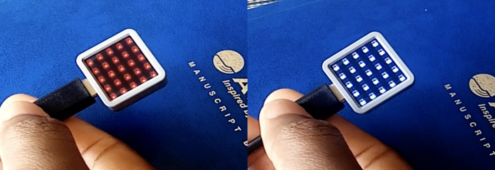
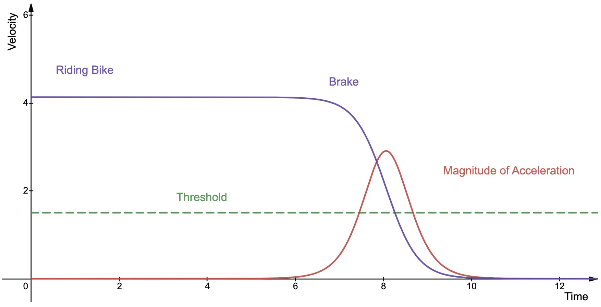
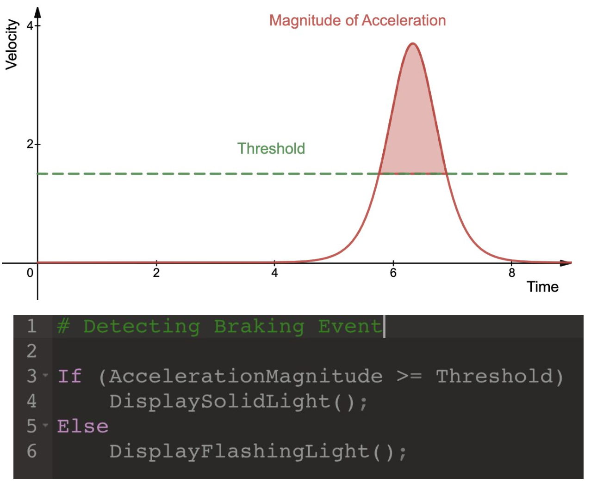

# M5 Stack Atom Matrix Challenge
**Part I, The First (Bike Light)**
**Team 21 (Umer Bin Liaqat, Omar Elkammah, Sherifa Yakubu, Pi Ko)**


Demonstration Video available on [YouTube here](https://www.youtube.com/watch?v=d_31dPjpohU).




This is the repository of our class project for ENGR-UH 1021J: Design & Innovation Summer 2021, taught by Instructor Matthew Karau.

We used an M5 Stack Atom Matrix to prototype a bike light.

Clicking the screen button cycles through modes:

- OFF: All LEDs off
- Manual Rear strobe (RED): LEDs strobe at a predetermined interval
- Manual Front strobe (WHITE): LEDs strobe at a predetermined interval
- Automatic Rear Mode Rear (RED): LEDs are solid during a braking event. Return to strobe when riding.
- Automatic Front Mode Rear (White): LEDs are solid during a braking event. Return to strobe when riding.

## Dependencies
- M5Atom Library (follow these steps [here](https://docs.m5stack.com/en/arduino/arduino_development))

## Theory

In order to obtain the instantaneous acceleration data, we used the Inertial Measurement Unit (IMU) inside M5 Stack Atom using the following line

```cpp
M5.IMU.getAccelData(&accX, &accY, &accZ);
```

To smoothen out the instantaneous acceleration data, we calculated the [Modified moving average](https://en.wikipedia.org/wiki/Moving_average#Modified_moving_average) using the following formula.


When the bike brakes (i.e. decelerates), the velocity of the bike decreases suddenly. Therefore, there is a sharp increase in the magnitude of the acceleration of the bike. This change in magnitude for braking is greater than a threshold.



We determined the threshold experimentally, and programmed the device in a way that the lights should be solid when the acceleration is above the threshold. Otherwise, the lights should blink.

