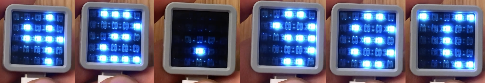

# M5 Stack Atom Matrix Challenge
**Part I, The Second (Bike Light)**
**Team 21 (Umer Bin Liaqat, Omar Elkammah, Sherifa Yakubu, Pi Ko)**


Demonstration Video available on [YouTube here](https://www.youtube.com/watch?v=pQHyVHZSXYU).




This is the repository of our class project for ENGR-UH 1021J: Design & Innovation Summer 2021, taught by Instructor Matthew Karau.

We wote a code for the M5 Stack Atom Matrix development board to make it function as a
multi-purpose thermometer and temperature tracker.

In normal operation, the device is measuring temperature and recording it at a predetermined interval, and the
screen displays nothing.
When holding the device in the hand with the screen facing relatively upwards, tapping the screen OR pressing the
screen button activates the screen.
When the screen is activated, the user is able to change modes between the following by tipping the device left or
right (assuming the bottom of the device is where the USB-C port resides)
To activate a given mode, the user either clicks the screen or taps the device.
To exit the active display mode, the user turns the device face-down, and the device returns to background reading
mode with screen off.

 Modes:
- Show Active temperature + Units
- Show average of last 24 hours of temperature + Units
- Show color scale of temperature range + current temperature as color
- Show graph of temperature across a predefined range.
- Change units


## Dependencies
- M5Atom Library (follow these steps [here](https://docs.m5stack.com/en/arduino/arduino_development))

## Theory

To show color scale of temperature range and current temperature as color we choose a midpoint for normal temperature to be 110F to the left of this number we chose two numbers to represent the end of cold,100 (ie from 110 to 100 is cold) and an upper limit for freezing,90F.To the right we did the same from 110 to 120 is warm and from 120 to 130 is hot. Then using a set of if else statements we assigned the corresponding colours to these intervals ranging from Deep Blue to Orange.  

```cpp
if (tempF < lowestTempF)
    {
        DisplayColor(GRB_COLOR_BLUE);
    }
    else if (lowestTempF < tempF && tempF < lowTempF)
    {
        DisplayColor(TempLowest);
    }
```

We dedicated the final row of the screen to display the color range so the user can compare the color of the current temperature displayed in the  first 4 rows to this color range and easily determine if it is hot normal or cold

```cpp

M5.dis.drawpix(0, 4, TempLowest );

```


To show graph of temperature across a we sampled the temperatures at a rate of 5 per group. In aech group we found the average but our range of temperatures were in the 30's and 40's in degree celcuis which could not be represented in a 5 by 5 matrix. So we shrunk the graph  vertically by multiplying the average by a suitable scale factor. We then made the middle row of the matrix the average temperature line such that there is room above and below to represent deviation from the average of all the temperatures.  

 ```cpp
 
  temp_graph_sum = 0;
    for (int i = 0; i < 5; i++)
    {
        temp_graph_sum += temp_data[i];
    }

    float temp_average = temp_graph_sum / 5.00;

    //Normalize the temperature data,and make it sensitive to 0.01 ˚ C
    for (int i = 0; i < 5; i++)
    {
        temp_data[i] = (temp_data[i] - temp_average) * 100.00;
    }

```

